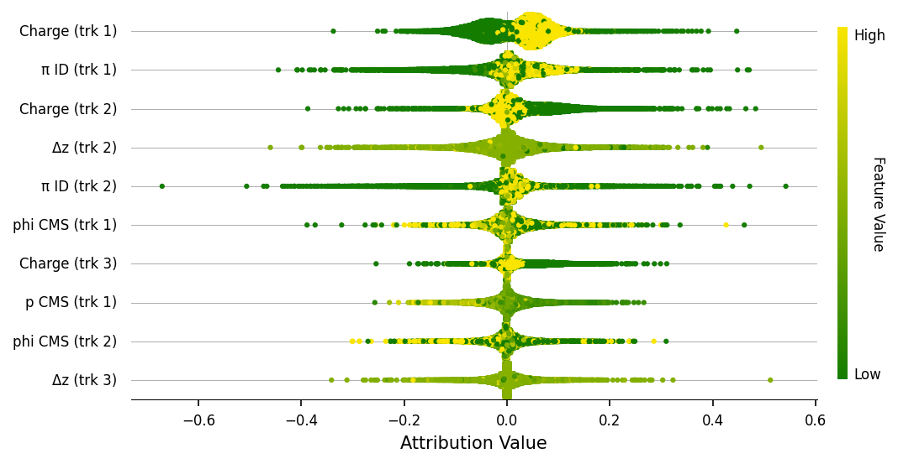
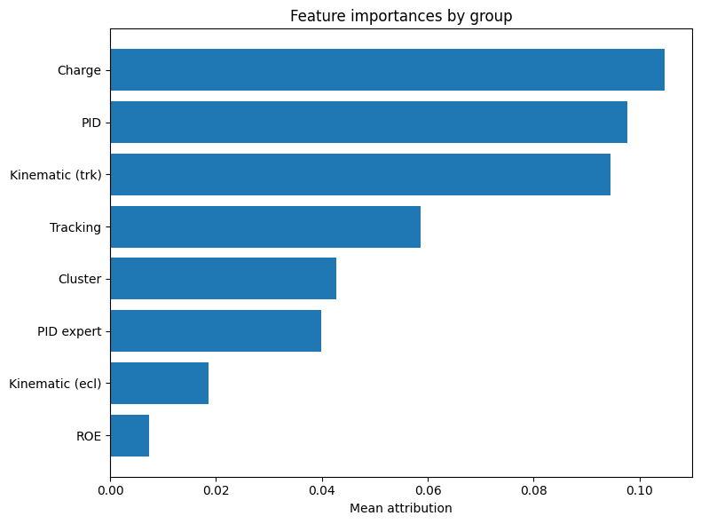

# TFlaT

This README describes the training process of the transformer based flavortagger TFlaT.\
The provided scripts cover all steps that are required to get from the parquet files with training data to a weightfile with the trained model.
It also covers the computation of the effective tagging efficiency on a seperate test data set, and provides a way to interpret the importance from the variables by calculating the variable attributions. 


---

## Setup the software

Create a conda environment by executing lines below:

```
git clone https://github.com/BenjaminSchwenker/tflat.git
cd tflat

conda create -n tflat  python=3.11.9
conda activate tflat

pip install 'tensorflow[and-cuda]'
pip install pandas
pip install pyarrow
pip install PyYAML
pip install uncertainties
```

Confirm that tensorflow is seeing your GPU by typing:

```
python3 -c "import tensorflow as tf; print(tf.config.list_physical_devices('GPU'))"
```

In case the GPU device is not found, your system may be missing GPU drivers. Please
follow the instructions on this page: https://www.tensorflow.org/install/pip

---

## Training Samples

The Training of TFlaT requires $B^0 \rightarrow \nu \overline{\nu}$ samples to be produced. You can find the samples for training, validating and testing on zenodo following this link: https://zenodo.org/records/19632131

---

## Hardware Requirements
The training process requires a CUDA capable GPU.\
Your GPU should have 8GB VRAM and your PC should have 16GB RAM.\
The time needed to complete a training depends on the specific GPU. For a NVIDIA A100 GPU the expected time to completion with 10M training samples is ~1 days.\

---

## Step-by-Step Guide

1. **Data preparation**

Download the files training_samples.parquet, validation_samples.parquet and test_samples.parquet from zenodo (https://zenodo.org/records/19632131).\
The training_samples.parquet file contains 10Mio training samples and the other two files contain 1Mio samples each.\ 

2. **Training**
    - To launch the training use the `trainer.py` script:
    ```bash
   python3 trainer.py --train_input /path/to/parquet/TFlaT_training_samples.parquet --val_input /path/to/parquet/TFlaT_validation_samples.parquet --configFile config.yaml
    ```
    - Should the training crash at any point it can be restarted from the latest checkpoint like this:
    ```bash
   python3 trainer.py --train_input /path/to/parquet/TFlaT_training_samples.parquet --val_input /path/to/parquet/TFlaT_validation_samples.parquet --configFile config.yaml --warmstart
    ```
   - Once the training is done a keras weightfile is produced.

3. **Compute effective tagging efficiency**
   - The effective tagging efficiency is the main performance metric to evaluate flavor taggers at Belle II. 
   - See paper for details: https://doi.org/10.1140/epjc/s10052-022-10180-9
   - To compute the effective tagging efficiency on test data, run the next command
   ```bash
   python3 evaluate.py --test_input /path/to/parquet/TFlaT_test_samples.parquet --model model.keras --configFile config.yaml
   ```
## Explainer

The explainer feature provides a way of calculating the attibutions values for Tflat. The algorithm used is Integrated Gradients through the library path-explain (https://github.com/suinleelab/path_explain.git). The attributions can be visualized in the jupyter notebook provided. 

#### Note 
For compatibility purposes, this code runs on the following versions:
 - keras: 3.14.1
 - tensorflow: 2.21.0

### Usage

1. **Set up** 
For the usage of the explainer feature some extra packages are required. In the same virtual environment run: 
```
pip install path-explain
pip install mathplotlib
```

2. **Set parameters**

The parameters used for the attribution calculation are at the end of the file `config.yaml`. The following parameters can be modified:

   - *num_samples*: [int] number of samples taken from the data file to reduce computing time.
   - *num_steps*:  [int] number of steps drawn for each sample during the computation of Integrated Gradients.
   - *use_expectation*: [Bool] it's possible to use expected gradients instead of integrated gradients. If set to True, the attributions will be calculated using Expected Gradients.

3. **Calculate attributions**

To launch the calculation use the `explainer.py` script:
```
python3 explainer.py --data path/to/parquet/TFlaT_test_samples.parquet --model model.keras --configFile explainerConfig.yaml
```

This will produce an npz file containing the attributions and the samples used. The default name of this file is `attributions.npz`. This name can be modified by passing the parameter:
```
--output myAttributions
```
4. **Plot attributions**
Use the jupyter notebook `attr_plot.ipynb` as a tool to prudce plots:
- Bewswarm plot



- Bar plot groupping variables

